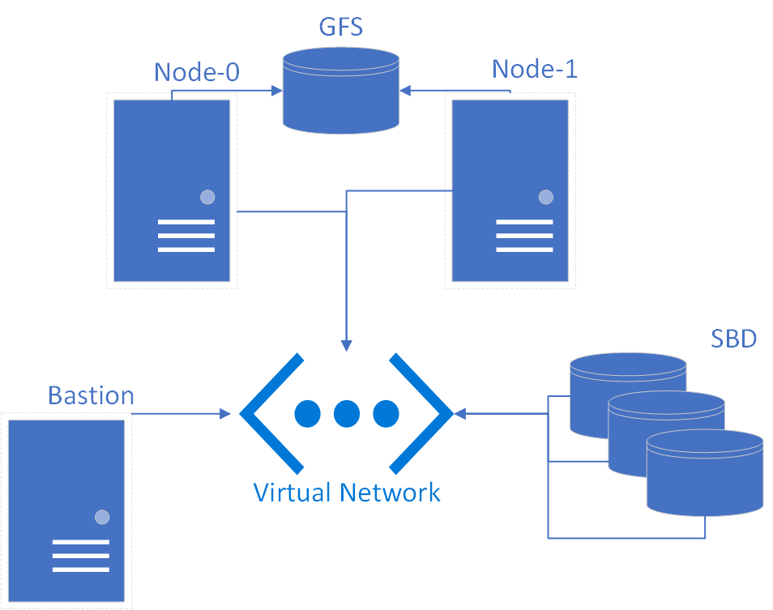

# Repository Code Overview

This document lists every file in the repository along with a short description and its contents.

## Directory Structure
```text
├── Dockerfile                 - Container with az CLI, Terraform, and Ansible
├── README.md                  - Usage instructions
├── main.tf                    - Entry point Terraform config
├── outputs.tf                 - Terraform outputs
├── lab.yml                    - Main Ansible playbook
├── no_gfs_lab.yml             - Alternative playbook without GFS
├── myazure_rm.yml             - Dynamic inventory for Ansible/azure_rm plugin
├── node.config/               - Scripts and configs pushed to the VMs
└── modules/
    ├── resource_group/        - Terraform module for resource group
    ├── network/               - Module for VNet/subnet
    ├── bastion/               - Module for bastion host
    └── node_pair/             - Module for two cluster nodes with shared disks
```

## Dockerfile
Container recipe building an Ubuntu 22.04 image.
It installs the Azure CLI, HashiCorp Terraform, and Ansible, then starts a Python HTTP server on port 80.

```Dockerfile
FROM ubuntu:22.04

# update the package lists
RUN apt-get update

# install AZCLI
RUN apt-get install -y curl
RUN curl -sL https://aka.ms/InstallAzureCLIDeb | bash

# install Terraform
RUN apt-get install -y gnupg software-properties-common
RUN apt-get install -y wget
RUN wget -O- https://apt.releases.hashicorp.com/gpg | \
gpg --dearmor | \
tee /usr/share/keyrings/hashicorp-archive-keyring.gpg
RUN gpg --no-default-keyring \
--keyring /usr/share/keyrings/hashicorp-archive-keyring.gpg \
--fingerprint
RUN echo "deb [signed-by=/usr/share/keyrings/hashicorp-archive-keyring.gpg] \
https://apt.releases.hashicorp.com $(lsb_release -cs) main" | \
tee /etc/apt/sources.list.d/hashicorp.list
RUN apt-get update
RUN apt-get install -y terraform

# install Ansible
RUN add-apt-repository --yes --update ppa:ansible/ansible
RUN apt-get update
RUN apt install -y ansible

# set the working directory
WORKDIR /app

# copy any necessary files into the container
COPY . ./

# expose any necessary ports
EXPOSE 80

# set the command to run when the container starts
# CMD ["/bin/bash"]
#ENTRYPOINT service apache2 start && /bin/bash
ENTRYPOINT python3 -m http.server 80 --directory /tmp/ & /bin/bash

```

## README.md
Main documentation for the project.
It details installation steps, usage of the playbooks, customizing the Terraform modules, and cleanup procedures.

```markdown

# Overview  
## Use Terraform and Ansible to create a Pacemaker cluster with GFS storage. The cluster storage is created with an Azure Ultra shared disk. The SBD devices are also Azure Ultra shared disks, and not hosted by VMs.  
# Installation
## Requires the latest Terraform and Ansible
Azure Cloudshell has both Terraform and Ansible preinstalled, so cloning and launching from Cloudshell is convienent.
## Installation in your local Linux environment 
Cloudshell in the Portal times out after 20 minutes, so installing in your local environment or Linux VM is a good option.  If you use Cloudshell, you will have to hit the keyboard every now and then to prevent a timeout.
### Links to install requirements
- az CLI
    1. https://docs.microsoft.com/en-us/cli/azure/install-azure-cli-linux?pivots=apt
- Terraform
    1. https://learn.hashicorp.com/tutorials/terraform/install-cli
- Ansible    
    1. https://docs.ansible.com/ansible/latest/installation_guide/intro_installation.html#installing-ansible-on-specific-operating-systems

# Run the playbook
## Login az CLI:
```console
az login
```  

### Clone the repository and run this command from root of project folder:
```console
ansible-playbook -i myazure_rm.yml lab.yml
```
### If you want to create the cluster without the GFS share, use this playbook:
```console
ansible-playbook -i myazure_rm.yml no_gfs_lab.yml
```  
### Changing the instance size or image
The main.tf in the root of the repo calls the node module to create the nodes
```hcl
module "nodes0" {
source = "./modules/node_pair"
rg = module.rg0.rg
region = module.network0.region
vm_size = "Standard_D2s_v3"     #<-----------------THIS LINE TO CHANGE INSTANCE SIZE 
az = "1"
subnet = module.network0.subnet 
publisher = "SUSE"              ###
offer = "sles-sap-12-sp5"       ###<---------------THESE LINES TO CHANGE IMAGE
sku = "gen2"                    ###
_version = "latest"             ###
}
```
### The resources will be created in a resource group specified in the root of the repo's main.tf
```hcl
module "rg0" {
  source = "./modules/resource_group"
  rg = "test_cluster_ultra"    #<-----------------THIS LINE TO CHANGE RESOURCE GROUP NAME
}
```
### Changing the region
```hcl
module "network0" {
    source = "./modules/network"
    rg = module.rg0.rg
    region = "westus2"        #<-----------------THIS LINE TO CHANGE REGION
}
```

# Deleting the environment
### The cluster can be deprovisioned by running:
```console
terraform delete
```  
You can also simply delete the resource group the cluster is in.  If you manually delete the resource group, terraform will leave behind the files:
1. terraform.tfstate
1. terraform.tfstate.backup

Delete the tfstate files and you ready to spin up another cluster.  If you do not want to wait for the previous resource group to be deleted, you can create a new resource group name in main.tf, and the new resources will be spun up in the new resource group.  

# Tips

### SSH Keys
If you do not already have SSH keys setup in your home directory, they will be created for you.  The public keys will be installed on all the nodes.  The username you should login with is 'azureadmin'.  If you already have SSH keys setup, you can login with your existing keys with the 'azureadmin' user, as your existing keys will be distributed to all nodes. Login to the bastion host first to be able to reach the cluster nodes.
### OS Images
```hcl
################################
# publisher = "SUSE"
# offer     = "sles-sap-15-sp2"
# sku       = "gen2"
# _version   = "latest"
################################
# publisher = "SUSE"
# offer     = "sles-sap-12-sp5"
# sku       = "gen2"
# _version   = "latest"
################################

```

## image.png
Screenshot referenced at the top of the README.

## lab.yml
Primary Ansible automation. It provisions the infrastructure with Terraform, distributes SSH keys, configures the dynamic inventory, installs packages on the VMs, and sets up the Pacemaker cluster with shared GFS2 storage.

```yaml
# Setup infrastructure and configure local environment
- name: Create lab environment
  hosts: localhost
  connection: local
  tasks:
  - name: Generate personal SSH keys if they do not already exist
    openssh_keypair:
      path: ~/.ssh/id_rsa
      force: False
      regenerate: never
  - name: Generate Lab SSH keys
    openssh_keypair:
      path: ~/.ssh/lab_rsa
      force: False
      regenerate: never      
  - name: Terraform apply
    terraform:
      lock: no
      force_init: true
      project_path: './'
      state: present
  - name: Configure local alias
    blockinfile:
      path: ~/.bashrc
      state: present
      block: |
        alias bastion='ssh -i ~/.ssh/lab_rsa azureadmin@`terraform output -raw bastion_ip`'
        ANSIBLE_STDOUT_CALLBACK=debug
  - name: Terraform refresh
    shell: terraform refresh
  - name: Create rg file for dynamic inventory
    shell: echo { \"rg\":\"`terraform output -raw rg`\" } > rg.json
  - name: Include vars of stuff.yaml into the 'stuff' variable
    include_vars:
      file: rg.json
      name: stuff
  - name: Configure dynamic inventory file
    blockinfile:
      path: ./myazure_rm.yml
      state: present
      block: |
        include_vm_resource_groups:
        - {{ stuff["rg"] }}
  - name: Refresh inventory to ensure new instances exist in inventory
    meta: refresh_inventory

# Update packages on all hosts
- name: Zypper update
  hosts: all
  remote_user: azureadmin
  become: yes
  tasks:
  - name: Zypper update
    command: sudo zypper up -y --skip-interactive

# Configure bastion host with SSH keys
- name: Push SSH key to bastion
  hosts: tag_group_bastion
  remote_user: azureadmin
  become: yes
  tasks:
  - name: Set personal authorized key taken from file
    authorized_key:
      user: azureadmin
      state: present
      key: "{{ lookup('file', '~/.ssh/id_rsa.pub') }}"
  - name: Push SSH azureadmin private key
    copy:
      src: ~/.ssh/lab_rsa
      dest: /home/azureadmin/.ssh/id_rsa
      mode: '0600'
      owner: azureadmin
      group: users
  - name: Configure etc hosts
    blockinfile:
      path: /etc/hosts
      state: present
      block: |
        # Cluster nodes
        10.0.0.6 node-0
        10.0.0.7 node-1

# Distribute SSH client config to all VMs
- name: Push SSH config
  hosts: all
  remote_user: azureadmin
  tasks:
  - name: Push SSH config to all VMs
    copy:
      src: ssh.config/ssh.config
      dest: /home/azureadmin/.ssh/config
      owner: azureadmin
      group: users

# Install root SSH keys on cluster nodes
- name: Push root SSH keys to nodes
  hosts: tag_group_node0 tag_group_node1
  remote_user: azureadmin
  become: yes
  tasks:
  - name: Create /root/.ssh directory
    file:
      path: /root/.ssh/
      state: directory
      mode: '0700'
  - name: Copy root private key
    copy:
      src: ~/.ssh/lab_rsa
      dest: /root/.ssh/id_rsa
      owner: root
      group: root
      mode: '0600'
  - name: Copy root public key to authorized keys
    copy:
      src: ~/.ssh/lab_rsa.pub
      dest: /root/.ssh/authorized_keys
      owner: root
      group: root
      mode: '0644'
  - name: Copy root public key to .ssh
    copy:
      src: ~/.ssh/lab_rsa.pub
      dest: /root/.ssh/id_rsa.pub
      owner: root
      group: root
      mode: '0644'
  - name: Configure etc hosts
    blockinfile:
      path: /etc/hosts
      state: present
      block: |
        # IP address of the first cluster node
        10.0.0.6 node-0
        # IP address of the second cluster node
        10.0.0.7 node-1

# Configure services and kernel parameters on both nodes
- name: Configure nodes
  hosts: tag_group_node0 tag_group_node1
  remote_user: azureadmin
  become: yes
  tasks:
  - name: Enable iscsid
    service:
      name: iscsid
      enabled: yes
  - name: Enable iscsi
    service:
      name: iscsi
      enabled: yes
  - name: Enable sbd
    command: sudo systemctl enable sbd
  - name: Start iscsid
    service:
      name: iscsid
      state: restarted
  - name: Start iscsi
    service:
      name: iscsi
      state: restarted
  - name: Retrieve IDs of iSCSI devices, Create the SBD devices, Adapt the SBD config
    script: node.config/node.sbd.config.py
    args:
      executable: python
      creates: /etc/delete.to.retry.node.sbd.config.py
  - name: Create the softdog configuration file
    copy:
      src: node.config/node.softdog.config
      dest: /etc/modules-load.d/softdog.conf   
  - name: Load softdog module
    command: sudo modprobe -v softdog
  - name: Install socat
    zypper:
      name: socat
      state: present
  - name: Install resource-agents
    zypper:
      name: resource-agents
      state: present
  - name: Configure systemd
    copy:
      src: node.config/node.systemd.config
      dest: /etc/systemd/system.conf
      owner: root
      group: root  
      mode: '0644'
  - name: Reload daemon-reload
    command: sudo systemctl daemon-reload 
  - name: Configure systemd
    copy:
      src: node.config/node.sysctl.config
      dest: /etc/sysctl.conf
      owner: root
      group: root  
      mode: '0644'
  - name: Configure interface
    run_once: true
    copy:
      src: node.config/node.interface.config
      dest: /etc/sysconfig/network/ifcfg-eth0
      owner: root
      group: root  
      mode: '0644'
  - name: Install fence-agents
    zypper:
      name: fence-agents
      state: present

# Initialize cluster on node0
- name: Configure node0
  hosts: tag_group_node0
  remote_user: azureadmin
  become: yes
  tasks:
  - name: Stop corosync
    command: sudo service corosync stop
    args:
      creates: /etc/corosync/corosync.conf
  - name: Stop pacemaker
    command: sudo service pacemaker stop
    args:
      creates: /etc/corosync/corosync.conf
  - name: Configure ha-cluster-init
    expect:
      command: sudo ha-cluster-init -u
      echo: yes
      creates: /etc/corosync/corosync.conf
      responses:
        "Do you want to continue anyway (y/n)?": "y"
        "/root/.ssh/id_rsa already exists - overwrite (y/n)?": "n"
        '  Address for ring0': ""
        "  Port for ring0": ""
        "Do you wish to use SBD (y/n)?": "y"
        "Do you wish to configure a virtual IP address (y/n)?": "n"
        'csync2 is already configured - overwrite (y/n)?': 'y'
        '/etc/corosync/authkey already exists - overwrite (y/n)?': 'y'        
        '/etc/pacemaker/authkey already exists - overwrite (y/n)?': 'y'
        'SBD is already configured to use': 'n'
      timeout: 300
  - name: Update corosync config
    copy:
      src: node.config/node.corosync.config
      dest: /etc/corosync/corosync.conf
  - name: Restart corosync
    command: sudo service corosync restart

# Join node1 to the cluster
- name: Configure node1
  hosts: tag_group_node1
  remote_user: azureadmin
  become: yes
  tasks:
  - name: Stop corosync
    command: sudo service corosync stop
    args:
      creates: /etc/corosync/corosync.conf
  - name: Stop pacemaker
    command: sudo service pacemaker stop
    args:
      creates: /etc/corosync/corosync.conf
  - name: Join node to cluster
    expect:
      command: sudo ha-cluster-join
      echo: yes
      creates: /etc/corosync/corosync.conf
      responses:
        'Do you want to continue anyway (y/n)?': 'y'
        '  IP address or hostname of existing node': '10.0.0.6'
        '/root/.ssh/id_rsa already exists - overwrite (y/n)?': 'n'
        '  Address for ring0': ''
      timeout: 300

# Set up STONITH device on node0
- name: Configure node0
  hosts: tag_group_node0
  remote_user: azureadmin
  become: yes
  tasks:
  - name: Configure stonith device
    script: node.config/node.stonith.config.sh
    args:
      creates: /etc/delete.to.retry.node.stonith.config.sh

# Install GFS2 tooling on both nodes
- name: Install GFS packages
  hosts: tag_group_node0 tag_group_node1
  remote_user: azureadmin
  become: yes
  tasks:
  - name: Install gfs2-utils
    zypper:
      name: gfs2-utils
      state: present

# Configure shared GFS2 filesystem on node0
- name: Create GFS
  hosts: tag_group_node0
  remote_user: azureadmin
  become: yes
  tasks:
  - name: Create GFS partition and filesystem
    script: node.config/node.shared.config.py
    args:
      executable: python
      creates: /etc/delete.to.retry.node.shared.config.py
  - name: Create GFS cluster resources
    script: node.config/node.gfs.config.sh
    args:
      creates: /etc/delete.to.retry.node.gfs.config.sh

# Rescan disks on node1 to pick up GFS changes
- name: Sync disks
  hosts: tag_group_node1
  remote_user: azureadmin
  become: yes
  tasks:
  - name: Sync disks to pickup GFS changes
    command: partprobe

# Start the shared filesystem resource via Pacemaker
- name: Start GFS cluster resource
  hosts: tag_group_node0
  remote_user: azureadmin
  become: yes
  tasks:
  - name: Start GFS resource 
    command: crm resource start gfs2-1

```

## main.tf
Top level Terraform configuration.
Top level Terraform configuration that calls the resource group, network, bastion, and node modules with their parameters.

```hcl
module "rg0" {
  source = "./modules/resource_group"
  rg = "test_cluster_ultra"
}

module "network0" {
    source = "./modules/network"
    rg = module.rg0.rg
    region = "westus2"
}

module "bastion0" {
source = "./modules/bastion"
rg = module.rg0.rg
region = module.network0.region
subnet = module.network0.subnet
publisher = "SUSE"
offer = "sles-sap-12-sp5"
sku = "gen2"
_version = "latest"
}

module "nodes0" {
source = "./modules/node_pair"
rg = module.rg0.rg
region = module.network0.region
vm_size = "Standard_D2s_v3"
az = "1"
subnet = module.network0.subnet
publisher = "SUSE"
offer = "sles-sap-12-sp5"
sku = "gen2"
_version = "latest"
}
```

## modules/bastion/main.tf
Terraform module for the bastion host. It builds a network security group with an SSH rule, associates the group with a NIC that has public and private IPs, and deploys a Linux VM using the provided image parameters.

```hcl
provider "azurerm" {
  features {}
}

# Create Network Security Group and rule
resource "azurerm_network_security_group" "ssh" {
    name                = var.region
    location            = var.region
    resource_group_name = var.rg

    security_rule {
        name                       = "SSH"
        priority                   = 101
        direction                  = "Inbound"
        access                     = "Allow"
        protocol                   = "Tcp"
        source_port_range          = "*"
        destination_port_range     = "22"
        source_address_prefix      = "*"
        destination_address_prefix = "*"
    }
}

resource "azurerm_subnet_network_security_group_association" "nsga" {
  subnet_id                 = var.subnet
  network_security_group_id = azurerm_network_security_group.ssh.id
}

# Create public IPs
resource "azurerm_public_ip" "ip" {
    name                         = var.region
    location                     = var.region
    resource_group_name          = var.rg
    allocation_method            = "Dynamic"
}

# Create network interface
resource "azurerm_network_interface" "nic" {
    name                      = var.region
    location                  = var.region
    resource_group_name       = var.rg

    ip_configuration {
        name                          = "bastion-public"
        subnet_id                     = var.subnet
        private_ip_address_allocation = "Static"
        private_ip_address            = "10.0.0.101"
        public_ip_address_id          = azurerm_public_ip.ip.id
        primary                       = "true"
    }

    ip_configuration {
        name                          = "bastion-private"
        subnet_id                     = var.subnet
        private_ip_address_allocation = "Static"
        private_ip_address            = "10.0.0.100"
    }
}

# Connect the security group to the network interface
resource "azurerm_network_interface_security_group_association" "isga" {
    network_interface_id      = azurerm_network_interface.nic.id
    network_security_group_id = azurerm_network_security_group.ssh.id
}

# Create virtual machine
resource "azurerm_linux_virtual_machine" "bastion" {
    name                  = "bastion-${var.region}"
    location              = var.region
    resource_group_name   = var.rg
    network_interface_ids = [azurerm_network_interface.nic.id]
    size                  = "Standard_E4s_v3"

    os_disk {
        name              =  var.region
        caching           = "ReadWrite"
        storage_account_type = "Premium_LRS"
        #disk_size_gb      = "128"
    }

    source_image_reference {
        publisher = var.publisher
        offer     = var.offer
        sku       = var.sku
        version   = var._version
    }

    computer_name  = "bastion-${var.region}"
    admin_username = "azureadmin"
    #custom_data    = file("<path/to/file>")

    admin_ssh_key {
        username       = "azureadmin"
        public_key     = file("~/.ssh/lab_rsa.pub")
    }
    
    tags = {
    group = "bastion"
    }
}
```

## modules/bastion/output.tf
Outputs from the bastion module. Provides the bastion VM's public IP address for later use.

```hcl
output "public_ip" {
  value = azurerm_public_ip.ip.ip_address
}
```

## modules/bastion/variables.tf
Variables controlling the bastion deployment. They specify the resource group, region, subnet, and the VM image details.

```hcl
variable "rg" {
  description = "The Resource Group name for all resources in this module"
}

variable "region" {
  description = "The Azure location where all resources in this example should be created"
}

variable "subnet" {
  description = "The subnet for all resources in this module"
}

################################
# publisher = "SUSE"
# offer     = "sles-sap-12-sp5"
# sku       = "gen2"
# _version   = "latest"
################################
# publisher = "SUSE"
# offer     = "SLES-SAP"
# sku       = "12-sp4-gen2"
# _version   = "latest"
################################
variable "publisher" {
  description = "Publisher of the image used to create VM"
}
variable "offer" {
  description = "Offer of the image used to create VM"
}
variable "sku" {
  description = "SKU of the image used to create VM"
}
variable "_version" {
  description = "Version of the image used to create VM, underscore added to avoid Terraform error"
}
```

## modules/network/main.tf
Terraform module to set up networking infrastructure. It provisions a virtual network and subnet for the cluster VMs.

```hcl
provider "azurerm" {
  features {}
}

resource "azurerm_virtual_network" "network" {
  name                = var.region
  resource_group_name = var.rg
  location            = var.region
  address_space       = ["10.0.0.0/16"]
}

resource "azurerm_subnet" "subnet" {
  name                 =  var.region
  virtual_network_name =  var.region
  resource_group_name  =  var.rg
  address_prefixes     = [ "10.0.0.0/24" ]
  depends_on = [ azurerm_virtual_network.network ]
}
```

## modules/network/output.tf
Outputs from the network module. Exposes the subnet ID and virtual network name for other modules.

```hcl
output "subnet" {
  value = azurerm_subnet.subnet.id
}

output "region" {
  value = azurerm_virtual_network.network.name
}
```

## modules/network/variables.tf
Variables for the network module. These specify the resource group and region used to create the virtual network and subnet.

```hcl
variable "rg" {
  description = "The Resource Group name for all resources in this module"
}

variable "region" {
  description = "The Azure location where all resources in this example should be created"
}
```

## modules/node_pair/main.tf
Terraform module creating two cluster nodes with shared disks. It launches two Linux VMs, creates several UltraSSD disks for SBD and GFS2, and attaches them to both machines.

```hcl
provider "azurerm" {
  features {}
}

resource "null_resource" "shared_disk0" {
  provisioner "local-exec" {
    command = "az disk create -g ${var.rg} -n shared_disk0 --size-gb 4 -l ${var.region} --sku UltraSSD_LRS --zone ${var.az} --disk-iops-read-write 120 --disk-mbps-read-write 10 --max-shares 2"
  }
}
resource "null_resource" "shared_disk1" {
  provisioner "local-exec" {
    command = "az disk create -g ${var.rg} -n shared_disk1 --size-gb 4 -l ${var.region} --sku UltraSSD_LRS --zone ${var.az} --disk-iops-read-write 120 --disk-mbps-read-write 10 --max-shares 2"
  }
}
resource "null_resource" "shared_disk2" {
  provisioner "local-exec" {
    command = "az disk create -g ${var.rg} -n shared_disk2 --size-gb 4 -l ${var.region} --sku UltraSSD_LRS --zone ${var.az} --disk-iops-read-write 120 --disk-mbps-read-write 10 --max-shares 2"
  }
}
resource "null_resource" "shared_disk3" {
  provisioner "local-exec" {
    command = "az disk create -g ${var.rg} -n shared_disk3 --size-gb 64 -l ${var.region} --sku UltraSSD_LRS --zone ${var.az} --disk-iops-read-write 240 --disk-mbps-read-write 50 --max-shares 2"
  }
}

data "azurerm_managed_disk" "existing0" {
  name                = "shared_disk0"
  resource_group_name = var.rg
  depends_on          = [ null_resource.shared_disk0, ]
}
data "azurerm_managed_disk" "existing1" {
  name                = "shared_disk1"
  resource_group_name = var.rg
  depends_on          = [ null_resource.shared_disk1, ]
}
data "azurerm_managed_disk" "existing2" {
  name                = "shared_disk2"
  resource_group_name = var.rg
  depends_on          = [ null_resource.shared_disk2, ]
}
data "azurerm_managed_disk" "existing3" {
  name                = "shared_disk3"
  resource_group_name = var.rg
  depends_on          = [ null_resource.shared_disk3, ]
}

# Create network interfaces
resource "azurerm_network_interface" "node-0" {
    name                      = "node-0"
    location                  = var.region
    resource_group_name       = var.rg

    ip_configuration {
        name                          = "node-0-private"
        subnet_id                     = var.subnet
        private_ip_address_allocation = "Static"
        private_ip_address            = "10.0.0.6"
        primary                       = "true"
    }
}
resource "azurerm_network_interface" "node-1" {
    name                      = "node-1"
    location                  = var.region
    resource_group_name       = var.rg

    ip_configuration {
        name                          = "node-1-private"
        subnet_id                     = var.subnet
        private_ip_address_allocation = "Static"
        private_ip_address            = "10.0.0.7"
        primary                       = "true"
    }
}

# Create virtual machine
resource "azurerm_linux_virtual_machine" "node-0" {
    name                  = "node-0"
    location              = var.region
    resource_group_name   = var.rg
    zone                  = var.az
    network_interface_ids = [azurerm_network_interface.node-0.id]
    size                  = var.vm_size

    os_disk {
        name              = "node-0"
        caching           = "ReadWrite"
        storage_account_type = "Premium_LRS"
        disk_size_gb      = "100"
    }

    source_image_reference {
        publisher = var.publisher
        offer     = var.offer
        sku       = var.sku
        version   = var._version
    }

    computer_name  = "node-0"
    admin_username = "azureadmin"
#    custom_data    = file("<path/to/file>")

    admin_ssh_key {
        username       = "azureadmin"
        public_key     = file("~/.ssh/lab_rsa.pub")
    }
    
    additional_capabilities {
      ultra_ssd_enabled = true
    }

    tags = {
    group = "node0"
    }
}

resource "azurerm_virtual_machine_data_disk_attachment" "shared_disk0_0" {
  managed_disk_id    = data.azurerm_managed_disk.existing0.id
  virtual_machine_id = azurerm_linux_virtual_machine.node-0.id
  lun                = "1"
  caching            = "None"
}
resource "azurerm_virtual_machine_data_disk_attachment" "shared_disk1_0" {
  managed_disk_id    = data.azurerm_managed_disk.existing1.id
  virtual_machine_id = azurerm_linux_virtual_machine.node-0.id
  lun                = "2"
  caching            = "None"
}
resource "azurerm_virtual_machine_data_disk_attachment" "shared_disk2_0" {
  managed_disk_id    = data.azurerm_managed_disk.existing2.id
  virtual_machine_id = azurerm_linux_virtual_machine.node-0.id
  lun                = "3"
  caching            = "None"
}
resource "azurerm_virtual_machine_data_disk_attachment" "shared_disk3_0" {
  managed_disk_id    = data.azurerm_managed_disk.existing3.id
  virtual_machine_id = azurerm_linux_virtual_machine.node-0.id
  lun                = "4"
  caching            = "None"
}

resource "azurerm_linux_virtual_machine" "node-1" {
    name                  = "node-1"
    location              = var.region
    resource_group_name   = var.rg
    zone                  = var.az
    network_interface_ids = [azurerm_network_interface.node-1.id]
    size                  = var.vm_size

    os_disk {
        name              = "node-1"
        caching           = "ReadWrite"
        storage_account_type = "Premium_LRS"
        disk_size_gb      = "100"
    }

    source_image_reference {
        publisher = var.publisher
        offer     = var.offer
        sku       = var.sku
        version   = var._version
    }

    computer_name  = "node-1"
    admin_username = "azureadmin"
#    custom_data    = file("<path/to/file>")

    admin_ssh_key {
        username       = "azureadmin"
        public_key     = file("~/.ssh/lab_rsa.pub")
    }

    additional_capabilities {
      ultra_ssd_enabled = true
    }

    tags = {
      group = "node1"
    }
}

resource "azurerm_virtual_machine_data_disk_attachment" "shared_disk0_1" {
  managed_disk_id    = data.azurerm_managed_disk.existing0.id
  virtual_machine_id = azurerm_linux_virtual_machine.node-1.id
  lun                = "1"
  caching            = "None"
}
resource "azurerm_virtual_machine_data_disk_attachment" "shared_disk1_1" {
  managed_disk_id    = data.azurerm_managed_disk.existing1.id
  virtual_machine_id = azurerm_linux_virtual_machine.node-1.id
  lun                = "2"
  caching            = "None"
}
resource "azurerm_virtual_machine_data_disk_attachment" "shared_disk2_1" {
  managed_disk_id    = data.azurerm_managed_disk.existing2.id
  virtual_machine_id = azurerm_linux_virtual_machine.node-1.id
  lun                = "3"
  caching            = "None"
}
resource "azurerm_virtual_machine_data_disk_attachment" "shared_disk3_1" {
  managed_disk_id    = data.azurerm_managed_disk.existing3.id
  virtual_machine_id = azurerm_linux_virtual_machine.node-1.id
  lun                = "4"
  caching            = "None"
}
```

## modules/node_pair/variables.tf
Variables for the node pair module. They control the resource group, region, VM size, availability zone, subnet, and image used when creating the nodes.

```hcl
variable "rg" {
  description = "The Resource Group name for all resources in this module"
}

variable "region" {
  description = "The Azure location where all resources in this example should be created"
}

variable "vm_size" {
  description = "The VM size/type"
}

variable "az" {
  description = "The Availibility Zone of the resource"
}

variable "subnet" {
  description = "The subnet for all resources in this module"
}

################################
# publisher = "SUSE"
# offer     = "sles-sap-12-sp5"
# sku       = "gen2"
# _version   = "latest"
################################
# publisher = "SUSE"
# offer     = "SLES-SAP"
# sku       = "12-sp4-gen2"
# _version   = "latest"
################################
variable "publisher" {
  description = "Publisher of the image used to create VM"
}
variable "offer" {
  description = "Offer of the image used to create VM"
}
variable "sku" {
  description = "SKU of the image used to create VM"
}
variable "_version" {
  description = "Version of the image used to create VM, underscore added to avoid Terraform error"
}
```

## modules/resource_group/main.tf
Terraform module that creates the Azure resource group for all other infrastructure.

```hcl
provider "azurerm" {
  features {}
}

resource "random_id" "name" {
  byte_length = 8
}

resource "azurerm_resource_group" "rg" {
  name     = "${var.rg}_${random_id.name.hex}"
  location = "westus2"
}

```

## modules/resource_group/output.tf
Outputs from the resource group module. Publishes the generated resource group name for other modules.

```hcl
output "rg" {
  value = azurerm_resource_group.rg.name
}
```

## modules/resource_group/variables.tf
Variables for the resource group module. Accepts a base name for the resource group which is combined with a random suffix.

```hcl
variable "rg" {
  description = "The Resource Group name for all resources in this module"
}
```

## myazure_rm.yml
Azure dynamic inventory configuration. Defines how Ansible queries Azure for hosts in the resource group and configures SSH to proxy via the bastion.

```yaml
plugin: azure_rm
auth_source: auto
hostvar_expressions:
  ansible_ssh_private_key_file: "'~/.ssh/lab_rsa'"
  ansible_user: "'azureadmin'"
  ansible_ssh_common_args: "'-i ~/.ssh/lab_rsa -o ProxyCommand=\"ssh -W %h:%p -i ~/.ssh/lab_rsa azureadmin@`terraform output -raw bastion_ip`\"'"
keyed_groups:
- prefix: tag
  key: tags

```

## no_gfs_lab.yml
Ansible playbook variant without GFS. It provisions the infrastructure but skips creating the shared GFS2 filesystem.

```yaml
- name: Create lab environment
  hosts: localhost
  connection: local
  tasks:
  - name: Generate personal SSH keys if they do not already exist
    openssh_keypair:
      path: ~/.ssh/id_rsa
      force: False
  - name: Generate Lab SSH keys
    openssh_keypair:
      path: ~/.ssh/lab_rsa
  - name: Terraform apply
    terraform:
      lock: no
      force_init: true
      project_path: './'
      state: present
  - name: Configure local alias
    blockinfile:
      path: ~/.bashrc
      state: present
      block: |
        alias bastion='ssh -i ~/.ssh/lab_rsa azureadmin@`terraform output -raw bastion_ip`'
        ANSIBLE_STDOUT_CALLBACK=debug
  - name: Terraform refresh
    shell: terraform refresh
  - name: Create rg file for dynamic inventory
    shell: echo { \"rg\":\"`terraform output -raw rg`\" } > rg.json
  - name: Include vars of stuff.yaml into the 'stuff' variable
    include_vars:
      file: rg.json
      name: stuff
  - name: Configure dynamic inventory file
    blockinfile:
      path: ./myazure_rm.yml
      state: present
      block: |
        include_vm_resource_groups:
        - {{ stuff["rg"] }}
  - name: Refresh inventory to ensure new instances exist in inventory
    meta: refresh_inventory

- name: Zypper update
  hosts: all
  remote_user: azureadmin
  become: yes
  tasks:
  - name: Zypper update
    command: sudo zypper up -y --skip-interactive

- name: Push SSH key to bastion
  hosts: tag_group_bastion
  remote_user: azureadmin
  become: yes
  tasks:
  - name: Set personal authorized key taken from file
    authorized_key:
      user: azureadmin
      state: present
      key: "{{ lookup('file', '~/.ssh/id_rsa.pub') }}"
  - name: Push SSH azureadmin private key
    copy:
      src: ~/.ssh/lab_rsa
      dest: /home/azureadmin/.ssh/id_rsa
      mode: '0600'
      owner: azureadmin
      group: users
  - name: Configure etc hosts
    blockinfile:
      path: /etc/hosts
      state: present
      block: |
        # Cluster nodes
        10.0.0.6 node-0
        10.0.0.7 node-1
- name: Push SSH config
  hosts: all
  remote_user: azureadmin
  tasks:
  - name: Push SSH config to all VMs
    copy:
      src: ssh.config/ssh.config
      dest: /home/azureadmin/.ssh/config
      owner: azureadmin
      group: users

- name: Push root SSH keys to nodes
  hosts: tag_group_node0 tag_group_node1
  remote_user: azureadmin
  become: yes
  tasks:
  - name: Create /root/.ssh directory
    file:
      path: /root/.ssh/
      state: directory
      mode: '0700'
  - name: Copy root private key
    copy:
      src: ~/.ssh/lab_rsa
      dest: /root/.ssh/id_rsa
      owner: root
      group: root
      mode: '0600'
  - name: Copy root public key to authorized keys
    copy:
      src: ~/.ssh/lab_rsa.pub
      dest: /root/.ssh/authorized_keys
      owner: root
      group: root
      mode: '0644'
  - name: Copy root public key to .ssh
    copy:
      src: ~/.ssh/lab_rsa.pub
      dest: /root/.ssh/id_rsa.pub
      owner: root
      group: root
      mode: '0644'
  - name: Configure etc hosts
    blockinfile:
      path: /etc/hosts
      state: present
      block: |
        # IP address of the first cluster node
        10.0.0.6 node-0
        # IP address of the second cluster node
        10.0.0.7 node-1
- name: Configure nodes
  hosts: tag_group_node0 tag_group_node1
  remote_user: azureadmin
  become: yes
  tasks:
  - name: Enable iscsid
    service:
      name: iscsid
      enabled: yes
  - name: Enable iscsi
    service:
      name: iscsi
      enabled: yes
  - name: Enable sbd
    command: sudo systemctl enable sbd
  - name: Start iscsid
    service:
      name: iscsid
      state: restarted
  - name: Start iscsi
    service:
      name: iscsi
      state: restarted
  - name: Retrieve IDs of iSCSI devices, Create the SBD devices, Adapt the SBD config
    script: node.config/node.sbd.config.py
    args:
      executable: python
      creates: /etc/delete.to.retry.node.sbd.config.py
  - name: Create the softdog configuration file
    copy:
      src: node.config/node.softdog.config
      dest: /etc/modules-load.d/softdog.conf   
  - name: Load softdog module
    command: sudo modprobe -v softdog
  - name: Install socat
    zypper:
      name: socat
      state: present
  - name: Install resource-agents
    zypper:
      name: resource-agents
      state: present
  - name: Configure systemd
    copy:
      src: node.config/node.systemd.config
      dest: /etc/systemd/system.conf
      owner: root
      group: root  
      mode: '0644'
  - name: Reload daemon-reload
    command: sudo systemctl daemon-reload 
  - name: Configure systemd
    copy:
      src: node.config/node.sysctl.config
      dest: /etc/sysctl.conf
      owner: root
      group: root  
      mode: '0644'
  - name: Configure interface
    run_once: true
    copy:
      src: node.config/node.interface.config
      dest: /etc/sysconfig/network/ifcfg-eth0
      owner: root
      group: root  
      mode: '0644'
  - name: Install fence-agents
    zypper:
      name: fence-agents
      state: present

- name: Configure node0
  hosts: tag_group_node0
  remote_user: azureadmin
  become: yes
  tasks:
  - name: Stop corosync
    command: sudo service corosync stop
    args:
      creates: /etc/corosync/corosync.conf
  - name: Stop pacemaker
    command: sudo service pacemaker stop
    args:
      creates: /etc/corosync/corosync.conf
  - name: Configure ha-cluster-init
    expect:
      command: sudo ha-cluster-init -u
      echo: yes
      creates: /etc/corosync/corosync.conf
      responses:
        "Do you want to continue anyway (y/n)?": "y"
        "/root/.ssh/id_rsa already exists - overwrite (y/n)?": "n"
        '  Address for ring0': ""
        "  Port for ring0": ""
        "Do you wish to use SBD (y/n)?": "y"
        "Do you wish to configure a virtual IP address (y/n)?": "n"
        'csync2 is already configured - overwrite (y/n)?': 'y'
        '/etc/corosync/authkey already exists - overwrite (y/n)?': 'y'        
        '/etc/pacemaker/authkey already exists - overwrite (y/n)?': 'y'
        'SBD is already configured to use': 'n'
      timeout: 300
  - name: Update corosync config
    copy:
      src: node.config/node.corosync.config
      dest: /etc/corosync/corosync.conf
  - name: Restart corosync
    command: sudo service corosync restart

- name: Configure node1
  hosts: tag_group_node1
  remote_user: azureadmin
  become: yes
  tasks:
  - name: Stop corosync
    command: sudo service corosync stop
    args:
      creates: /etc/corosync/corosync.conf
  - name: Stop pacemaker
    command: sudo service pacemaker stop
    args:
      creates: /etc/corosync/corosync.conf
  - name: Join node to cluster
    expect:
      command: sudo ha-cluster-join
      echo: yes
      creates: /etc/corosync/corosync.conf
      responses:
        'Do you want to continue anyway (y/n)?': 'y'
        '  IP address or hostname of existing node': '10.0.0.6'
        '/root/.ssh/id_rsa already exists - overwrite (y/n)?': 'n'
        '  Address for ring0': ''
      timeout: 300

- name: Configure node0
  hosts: tag_group_node0
  remote_user: azureadmin
  become: yes
  tasks:
  - name: Configure stonith device
    script: node.config/node.stonith.config.sh
    args:
      creates: /etc/delete.to.retry.node.stonith.config.sh

```

## node.config/node.corosync.config
Corosync configuration file defining multicast and authentication settings for the cluster.

```
# Please read the corosync.conf.5 manual page

totem {
    version:    2
    secauth:    on
    crypto_hash:    sha1
    crypto_cipher:  aes256
    cluster_name:   hacluster
    clear_node_high_bit: yes

    token:      30000
    token_retransmits_before_loss_const: 10
    join:       60
    consensus:  36000
    max_messages:   20

    interface {
        ringnumber: 0

        mcastport:   5405
        ttl: 1
    }


    transport: udpu


}

logging {
    fileline:   off
    to_stderr:  no
    to_logfile:     no
    logfile:    /var/log/cluster/corosync.log
    to_syslog:  yes
    debug:      off
    timestamp:  on
    logger_subsys {
        subsys:     QUORUM
        debug:  off
    }
}

nodelist {
    node {
        ring0_addr: 10.0.0.6

        nodeid: 1
    }
}

quorum {
    # Enable and configure quorum subsystem (default: off)
    # see also corosync.conf.5 and votequorum.5
    provider: corosync_votequorum
    expected_votes: 1
    two_node: 0
}
```

## node.config/node.gfs.config.sh
Bash script configuring Pacemaker resources for the DLM and GFS2 filesystem.

```bash
#!/bin/bash

crm configure primitive dlm ocf:pacemaker:controld op monitor interval="60" timeout="60"
crm configure primitive gfs2-1 ocf:heartbeat:Filesystem params device="/dev/disk/by-label/hacluster:mygfs2" directory="/mnt/shared" fstype="gfs2" op monitor interval="20" timeout="40" op start timeout="60" op stop timeout="60" meta target-role="Stopped"

crm configure group g-storage dlm  gfs2-1
crm configure clone cl-storage g-storage meta interleave="true"

```

## node.config/node.interface.config
Network interface configuration template providing basic settings for the nodes' primary NIC.

```
BOOTPROTO='dhcp'
DHCLIENT6_MODE='managed'
MTU=''
REMOTE_IPADDR=''
STARTMODE='onboot'
CLOUD_NETCONFIG_MANAGE='yes'
```

## node.config/node.sbd.config.py
Python script that scans for 4 GB disks, runs "sbd create" on each, and updates /etc/sysconfig/sbd with the resulting device list.

```python
#!/usr/bin/python

import subprocess

lsblk = subprocess.Popen(['lsblk'], stdout=subprocess.PIPE,)
grep = subprocess.Popen(['grep', '-w', '4G'], stdin=lsblk.stdout, stdout=subprocess.PIPE,)
disk = grep.stdout.readlines()
id = []
for i in disk:
  ls = subprocess.Popen(['ls', '-la', '/dev/disk/by-id/'], stdout=subprocess.PIPE,)
  grep2 = subprocess.Popen(['grep', i[0:3]], stdin=ls.stdout, stdout=subprocess.PIPE,)
  grep3 = subprocess.Popen(['grep', 'scsi-3'], stdin=grep2.stdout, stdout=subprocess.PIPE,)
  id.append('/dev/disk/by-id/' + grep3.stdout.read().split()[8])
for i in id:
  subprocess.call(['sudo', 'sbd', '-d', i, '-1', '60', '-4', '120', 'create'])
e = open("/tmp/sbd", "a")
f = open("/etc/sysconfig/sbd", "r")
for i in (f.read().splitlines()):
  if "#SBD_DEVICE=" in i:
    e.write("SBD_DEVICE=" + "\"" + ";".join(id) + "\"" + "\n")
  else:
    e.write(i + "\n")
e.close()
f.close()
subprocess.call(['cp', '/tmp/sbd', '/etc/sysconfig/sbd'])
subprocess.call(['rm', '/tmp/sbd'])
g = open("/etc/delete.to.retry.node.sbd.config.py", "w")
g.close()
```

## node.config/node.shared.config.py
Python script that finds the 64 GB shared disk, partitions it, and creates a GFS2 filesystem.

```python
#!/usr/bin/python

import subprocess

lsblk = subprocess.Popen(['lsblk'], stdout=subprocess.PIPE,)
grep = subprocess.Popen(['grep', '-w', '64G'], stdin=lsblk.stdout, stdout=subprocess.PIPE,)
disk = grep.stdout.readlines()
id = []
for i in disk:
  subprocess.call(['sudo', 'parted', '-s', '/dev/' + i.split()[0], 'mklabel', 'gpt'])
  subprocess.call(['sudo', 'parted', '-s', '-a', 'opt', '/dev/' + i.split()[0], 'mkpart', 'extended', '0%', '100%'])
  subprocess.call(['sudo', 'mkfs.gfs2', '-O', '-t', 'hacluster:mygfs2', '-p', 'lock_dlm', '-j', '2', '/dev/' + i.split()[0] + '1'])
g = open("/etc/delete.to.retry.node.shared.config.py", "w")
g.close()  
```

## node.config/node.softdog.config
Watchdog driver configuration.
Ensures the softdog kernel module is loaded for watchdog support.

```
softdog
```

## node.config/node.stonith.config.sh
Shell script that configures the STONITH fencing device using the SBD agent.

```bash
sudo crm configure property stonith-timeout=144
sudo crm configure property stonith-enabled=true
sudo crm configure primitive stonith-sbd stonith:external/sbd \
   params pcmk_delay_max="15" \
   op monitor interval="15" timeout="15"
sudo touch /etc/delete.to.retry.nfs.stonith.config.sh
```

## node.config/node.sysctl.config
Custom sysctl settings.
Provides kernel tuning parameters optimized for cluster workloads.

```
####
#
# /etc/sysctl.conf is meant for local sysctl settings
#
# sysctl reads settings from the following locations:
#   /boot/sysctl.conf-<kernelversion>
#   /lib/sysctl.d/*.conf
#   /usr/lib/sysctl.d/*.conf
#   /usr/local/lib/sysctl.d/*.conf
#   /etc/sysctl.d/*.conf
#   /run/sysctl.d/*.conf
#   /etc/sysctl.conf
#
# To disable or override a distribution provided file just place a
# file with the same name in /etc/sysctl.d/
#
# See sysctl.conf(5), sysctl.d(5) and sysctl(8) for more information
#
####

# Change/set the following settings
vm.dirty_bytes = 629145600
vm.dirty_background_bytes = 314572800
```

## node.config/node.systemd.config
Systemd configuration file.
Overrides default systemd limits such as TasksMax for cluster nodes.

```
#  This file is part of systemd.
#
#  systemd is free software; you can redistribute it and/or modify it
#  under the terms of the GNU Lesser General Public License as published by
#  the Free Software Foundation; either version 2.1 of the License, or
#  (at your option) any later version.
#
# Entries in this file show the compile time defaults.
# You can change settings by editing this file.
# Defaults can be restored by simply deleting this file.
#
# See systemd-system.conf(5) for details.

[Manager]
#LogLevel=info
#LogTarget=journal-or-kmsg
#LogColor=yes
#LogLocation=no
#DumpCore=yes
#ShowStatus=yes
#CrashChangeVT=no
#CrashShell=no
#CrashReboot=no
#CPUAffinity=1 2
#JoinControllers=cpu,cpuacct net_cls,net_prio
#RuntimeWatchdogSec=0
#ShutdownWatchdogSec=10min
#CapabilityBoundingSet=
#SystemCallArchitectures=
#TimerSlackNSec=
#DefaultTimerAccuracySec=1min
#DefaultStandardOutput=journal
#DefaultStandardError=inherit
#DefaultTimeoutStartSec=90s
#DefaultTimeoutStopSec=90s
#DefaultRestartSec=100ms
#DefaultStartLimitInterval=10s
#DefaultStartLimitBurst=5
#DefaultEnvironment=
#DefaultCPUAccounting=no
#DefaultBlockIOAccounting=no
#DefaultMemoryAccounting=no
#DefaultTasksAccounting=yes
#DefaultTasksMax=512
#DefaultLimitCPU=
#DefaultLimitFSIZE=
#DefaultLimitDATA=
#DefaultLimitSTACK=
#DefaultLimitCORE=
#DefaultLimitRSS=
#DefaultLimitNOFILE=
#DefaultLimitAS=
#DefaultLimitNPROC=
#DefaultLimitMEMLOCK=
#DefaultLimitLOCKS=
#DefaultLimitSIGPENDING=
#DefaultLimitMSGQUEUE=
#DefaultLimitNICE=
#DefaultLimitRTPRIO=
#DefaultLimitRTTIME=

DefaultTasksMax=4096
```

## outputs.tf
Outputs from the root Terraform module. They surface the bastion IP address and resource group name for the Ansible playbooks.

```hcl
output "bastion_ip" {
  value = module.bastion0.public_ip
}

output "rg" {
  value = module.rg0.rg
}
```

## ssh.config/ssh.config
OpenSSH configuration used by the playbooks to disable strict host checks.
Simplifies SSH access by disabling host key verification for automation.

```
Host *
   StrictHostKeyChecking no
   UserKnownHostsFile=/dev/null
```
