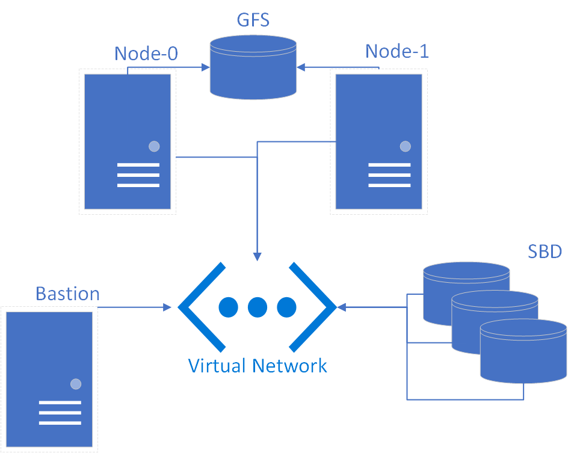

# Installation
## Requires the latest Terraform and Ansible
Azure Cloudshell has both Terraform and Ansible preinstalled, so cloning and launching from Cloudshell is convienent.
## Installation in your local Linux environment 
Cloudshell in the Portal times out after 20 minutes, so installing in your local environment or Linux VM is a good option.  If you use Cloudshell, you will have to hit the keyboard every now and then to prevent a timeout.
### Installation for Ubuntu
- Terraform
    1. $ curl -fsSL `https://apt.releases.hashicorp.com/gpg` | sudo apt-key add -
    2. $ sudo apt-add-repository "deb [arch=amd64] `https://apt.releases.hashicorp.com` $(lsb_release -cs) main"
    3. $ sudo apt-get update && sudo apt-get install terraform
- Ansible    
    1. $ sudo apt update
    2. $ sudo apt install software-properties-common
    3. $ sudo apt-add-repository --yes --update ppa:ansible/ansible
    4. $ sudo apt install ansible
- az CLI
    1. $ curl -sL `https://aka.ms/InstallAzureCLIDeb` | sudo bash **(Installs az CLI)**
    2. $ az login **(Run this and follow prompt to authenticate with Azure.  This only needs to be done once.)**
    3. $ az account list --output table **(Run this command to list your subscriptions)**
    4. $ az account set --subscription "My Subscription" **(Sets active subscription)**

# Clone the repository and run this command from root of project folder:
$ ansible-playbook -i myazure_rm.yml lab.yml

The cluster will be created in a resource group specified in the root module's main.tf.

## Login to the bastion host

### An alias to make it easy to login to the bastion is created in your local environment .bashrc

Source the .bashrc:

$ . ~/.bashrc

You can now login to the bastion with the alias:

$ bastion

# Deleting the cluster
### The cluster can be deprovisioned by running:

$ terraform delete

You can also simply delete the resource group the cluster is in.  If you manually delete the resource group, terraform will leave behind the files:
1. terraform.tfstate
1. terraform.tfstate.backup

Delete the tfstate files and you ready to spin up another cluster.  If you do not want to wait for the previous resource group to be deleted, you can create a new resource group name in main.tf